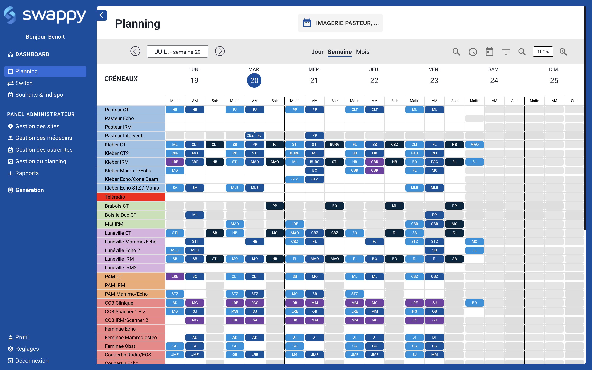

# Swappy - Test technique Frontend

Ce test fait partie de notre processus de recrutement pour les développeurs Frontend.

#### Consigne

L'objectif de ce test est de vous faire coder une petite application ReactJS.
Vous avez 6h pour reproduire un agenda par semaine avec les fonctionnalités suivantes :

-   Afficher les événements de l'agenda
-   Naviguer entre les semaines
-   Créer, modifier, supprimer un événement
-   Ajouter des outils (Zoom, retour à la date du jour, vue jour, vue mois)

Vous êtes libre d'architecturer votre projet comme bon vous semble.

Pour vous donner une idée, voilà à quoi ressemble notre agenda :


#### Installation

Vous devez avoir Node installés sur votre ordinateur

Lancer l'application avec la commande ci-dessous

```sh
npm start
```

#### Documentation

##### L'objet Service

-   id - ID unique du service
-   name - Nom du service

##### L'objet Slot

-   id - ID unique du créneau
-   service_id - ID du service auquel le créneau est rattaché
-   name - Nom du service
-   color - Couleur du créneau

##### L'objet Event

-   id - ID unique du service
-   user_id - ID de l'utilisateur à qui appartient cet événement
-   slot_id - ID du créneau auquel l'événement est rattaché
-   date - Date de l'événement au format "AAAA-MM-JJ"

##### L'objet User

-   id - ID unique de l'utilisateur
-   first_name - Prénom de l'utilisateur
-   last_name - Nom de l'utilisateur

#### Consignes supplémentaires

Vous avez la possibilité d'ajouter tous les modules que vous voulez afin de vous simplifier la tâche.

Si vous avez fini avant les 6h du test, surprenez nous ! Travaillez le design, ajoutez des fonctionnalités, montrez nous de quoi vous êtes capable !

Vous devrez créer un repository privé sur gitlab ou github afin de rendre le test.
Vous donnerez l'accès à :

-   gitlab -> Estorz (@Estorz)
-   github -> mdeglain

#### Conseil

`date-fns` (Module déjà installé)
